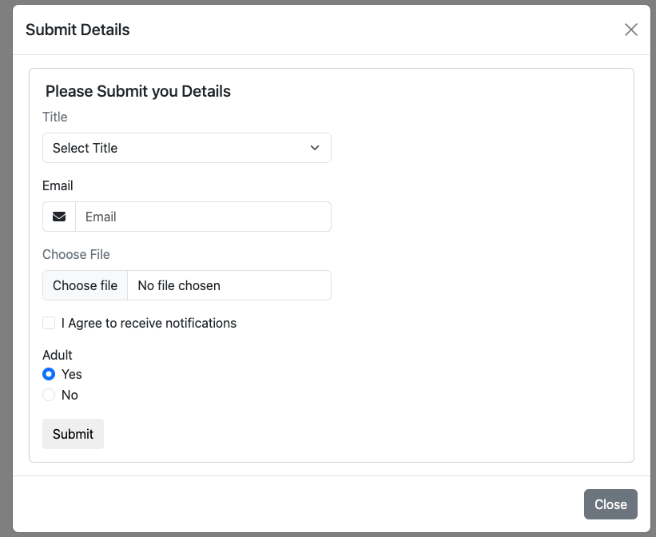
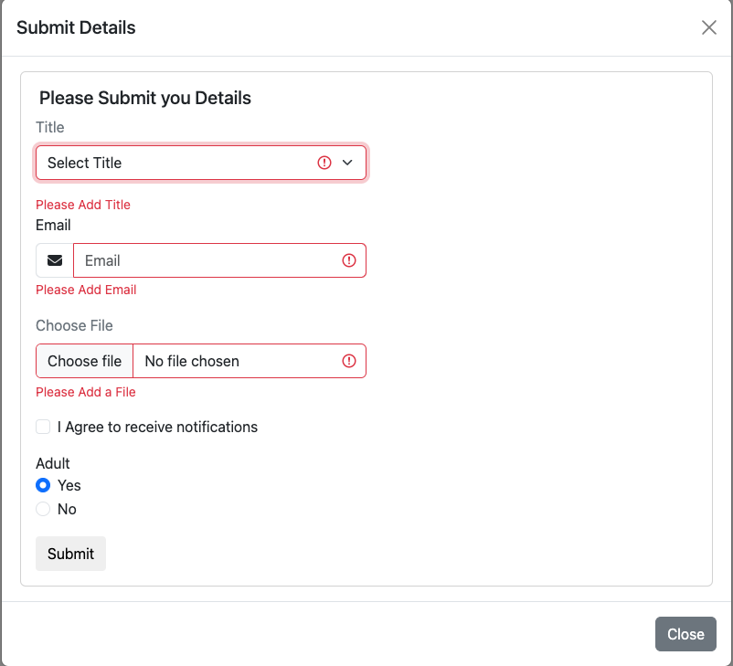
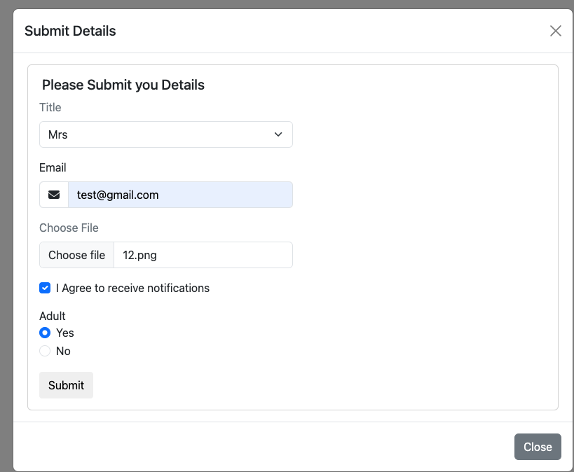
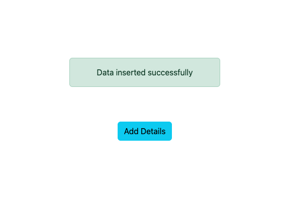

# Contedia Test Project

## Overview

This project demonstrates a modal popup form with content pulled via Object-Oriented PHP. The form submits data through a ```JavaScript-jQuery-AJAX``` promise to a PHP class that saves the data to a MySQL database table.

## Features

- Popup form with dropdown, checkbox, email, file upload, and radio button fields.
- JavaScript promise for form data submission.
- PHP class for secure data handling and database interaction.
- CSS styling for an aesthetically pleasing user interface.

## Prerequisites

Before you begin, ensure you have the following installed:

- Web server (e.g., Apache, Nginx)
- PHP (version 7 or higher)
- MySQL database

## Installation

1. Clone the repository:

    ```bash
    git clone https://github.com/your-username/contedia-test.git
    ```

2. Configure your web server to point to the project directory.

3. Update the database credentials in the `Database.php` file.

## Screenshots

Main area


Modal 


Validation


Inputs


Success message


Feel free to replace the image URLs (`images/1.png`, etc.) with the actual paths to your screenshots.

## Customization

Feel free to customize the form fields, styling, and validation in the code to suit your specific requirements.

## Contributing

If you'd like to contribute, please fork the repository and create a pull request. We welcome any improvements or bug fixes.

## License

This project is licensed under the [MIT License](LICENSE).
